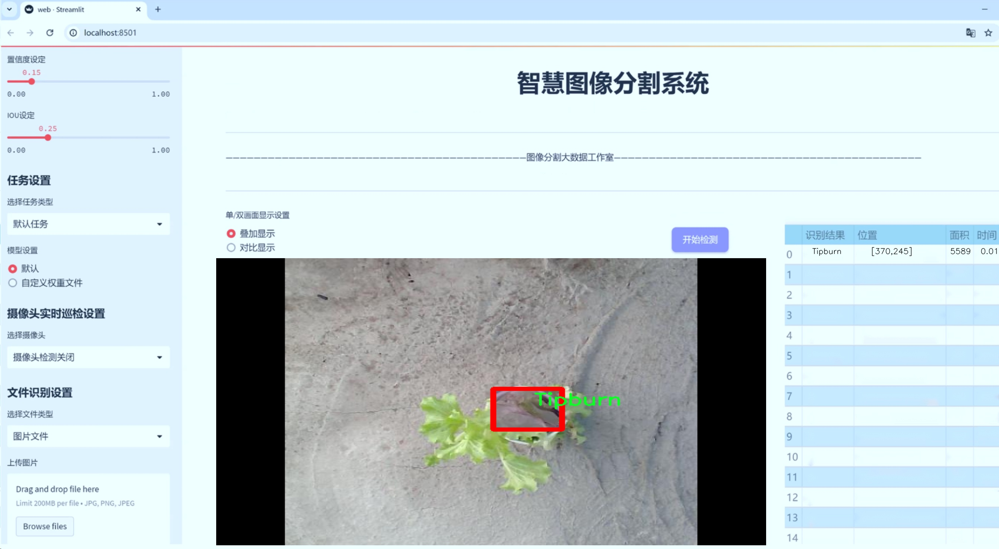
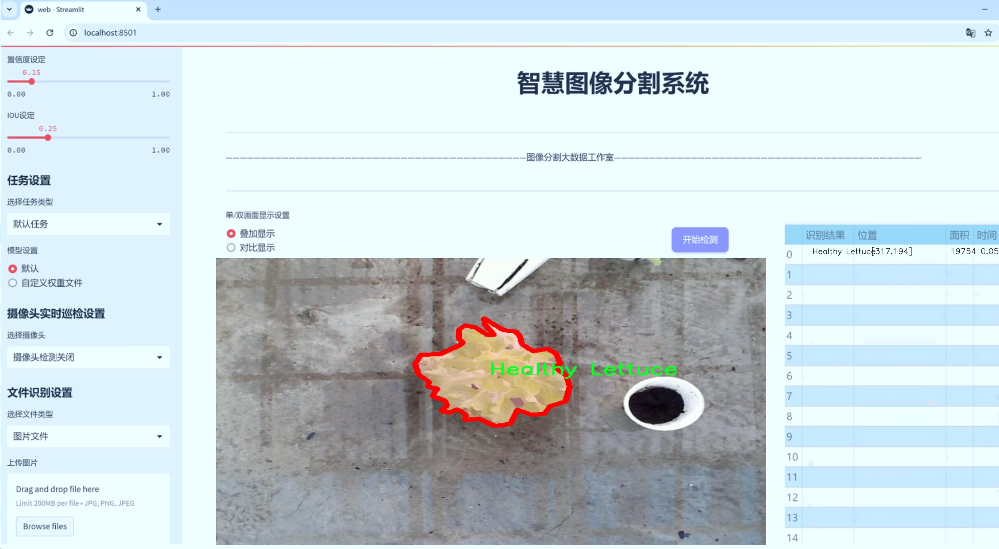
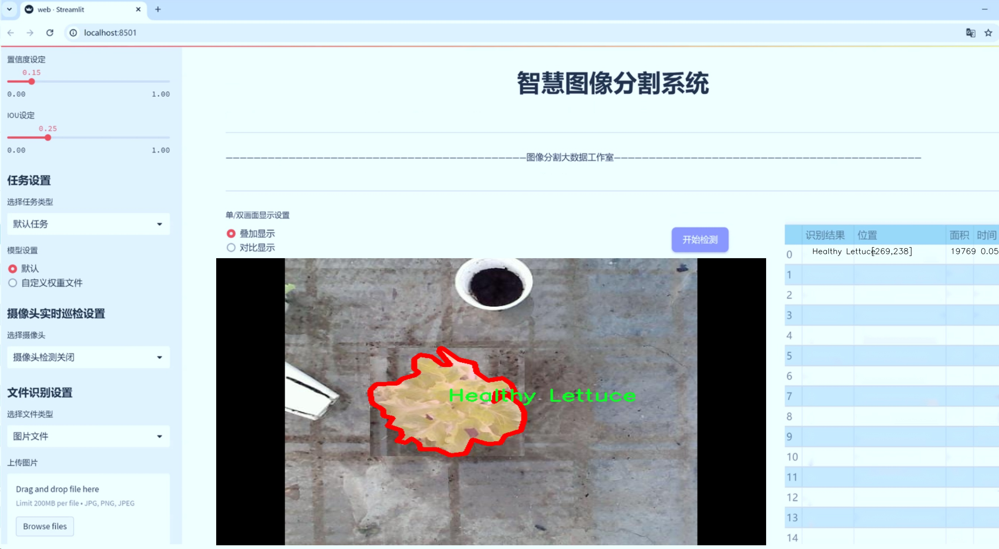
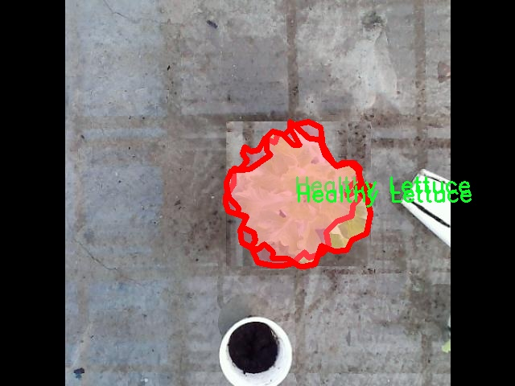
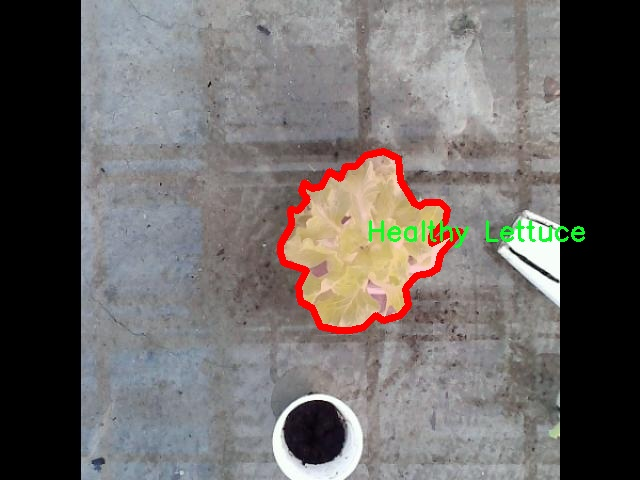
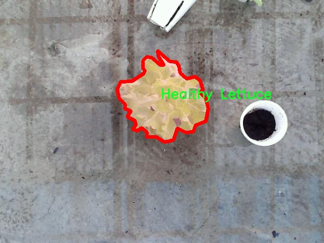

# 生菜健康状态分割系统源码＆数据集分享
 [yolov8-seg-C2f-DWR＆yolov8-seg-C2f-DLKA等50+全套改进创新点发刊_一键训练教程_Web前端展示]

### 1.研究背景与意义

项目参考[ILSVRC ImageNet Large Scale Visual Recognition Challenge](https://gitee.com/YOLOv8_YOLOv11_Segmentation_Studio/projects)

项目来源[AAAI Global Al lnnovation Contest](https://kdocs.cn/l/cszuIiCKVNis)

研究背景与意义

随着全球人口的不断增长和城市化进程的加快，农业生产面临着前所未有的挑战。尤其是在蔬菜种植领域，如何提高作物的产量和质量，保障食品安全，成为了亟待解决的问题。生菜作为一种广泛种植和消费的叶菜类蔬菜，其健康状态直接影响到产量和市场价值。因此，开发一种高效、准确的生菜健康状态监测系统，对于提升农业生产效率、减少资源浪费、保障食品安全具有重要的现实意义。

近年来，计算机视觉技术的快速发展为农业智能化提供了新的解决方案。尤其是基于深度学习的目标检测与分割技术，已经在多个领域取得了显著的成果。YOLO（You Only Look Once）系列模型以其高效的实时检测能力和良好的准确性，成为了目标检测领域的佼佼者。YOLOv8作为该系列的最新版本，进一步提升了模型的性能，尤其在处理复杂场景和小目标检测方面表现出色。因此，基于改进YOLOv8的生菜健康状态分割系统的研究，不仅具有技术上的创新性，也为农业生产提供了切实可行的解决方案。

本研究所使用的数据集包含1500张生菜图像，涵盖了7个类别，包括健康生菜、不同生长阶段的生菜以及生菜的病害状态（如Tipburn）。这些数据的多样性和丰富性为模型的训练提供了良好的基础。通过对这些图像进行实例分割，可以精确识别和分类不同健康状态的生菜，为后续的病害监测和生长阶段评估提供重要依据。这一过程不仅能够帮助农民及时发现和处理病害，减少损失，还能为农业管理决策提供数据支持，提升整体生产效率。

此外，基于改进YOLOv8的生菜健康状态分割系统的研究，还具有重要的社会意义。随着消费者对食品安全和健康的关注度日益提高，如何确保所购生菜的质量和安全性，成为了消费者关心的焦点。通过引入先进的计算机视觉技术，能够实现对生菜健康状态的实时监测，提升生菜的质量控制水平，进而增强消费者的信任感，促进生菜市场的健康发展。

综上所述，基于改进YOLOv8的生菜健康状态分割系统的研究，不仅是对计算机视觉技术在农业领域应用的探索，更是对提高农业生产效率、保障食品安全的重要实践。通过该系统的开发与应用，期望能够为现代农业的智能化发展提供新的思路和方法，推动农业生产的可持续发展。

### 2.图片演示







##### 注意：由于此博客编辑较早，上面“2.图片演示”和“3.视频演示”展示的系统图片或者视频可能为老版本，新版本在老版本的基础上升级如下：（实际效果以升级的新版本为准）

  （1）适配了YOLOV8的“目标检测”模型和“实例分割”模型，通过加载相应的权重（.pt）文件即可自适应加载模型。

  （2）支持“图片识别”、“视频识别”、“摄像头实时识别”三种识别模式。

  （3）支持“图片识别”、“视频识别”、“摄像头实时识别”三种识别结果保存导出，解决手动导出（容易卡顿出现爆内存）存在的问题，识别完自动保存结果并导出到tempDir中。

  （4）支持Web前端系统中的标题、背景图等自定义修改，后面提供修改教程。

  另外本项目提供训练的数据集和训练教程,暂不提供权重文件（best.pt）,需要您按照教程进行训练后实现图片演示和Web前端界面演示的效果。

### 3.视频演示

[3.1 视频演示](https://www.bilibili.com/video/BV1TfmvYTEPS/)

### 4.数据集信息展示

##### 4.1 本项目数据集详细数据（类别数＆类别名）

nc: 2
names: ['Healthy Lettuce', 'Tipburn']


##### 4.2 本项目数据集信息介绍

数据集信息展示

在本研究中，我们采用了名为“capstone1-2”的数据集，以训练和改进YOLOv8-seg模型，旨在实现生菜健康状态的精确分割。该数据集专注于生菜的健康状况，特别是区分健康生菜与因环境因素导致的“Tipburn”病症。数据集的设计考虑到了生菜在不同生长阶段和环境条件下的表现，确保了模型在实际应用中的有效性和鲁棒性。

“capstone1-2”数据集包含两个主要类别，分别是“Healthy Lettuce”和“Tipburn”。“Healthy Lettuce”类别代表了生菜在最佳生长条件下的状态，具有鲜亮的绿色和均匀的叶片结构，象征着良好的生长环境和健康的植物生理状态。此类别的数据样本不仅涵盖了不同品种的生菜，还包括了在不同光照、湿度和温度条件下拍摄的图像，以增强模型对健康生菜特征的学习能力。

另一方面，“Tipburn”类别则聚焦于生菜在遭受生理性病害时的表现，尤其是由于水分不足或环境温度波动等因素引起的叶尖枯萎现象。该类别的数据样本展示了生菜叶片的不同损伤程度，包括轻微的叶尖干枯和严重的叶片变色等特征。这些样本的多样性使得模型能够更好地识别和分割出受损的生菜区域，从而为后续的健康评估提供依据。

数据集的构建过程严格遵循了数据标注的标准化流程，确保每一张图像都经过专业人员的审核和标注。每个类别的样本数量经过精心设计，以保证模型在训练过程中能够获得均衡的学习机会，避免因类别不平衡而导致的性能下降。此外，数据集还包含了多种拍摄角度和背景，以提高模型在实际应用中的适应性和准确性。

为了进一步提升模型的泛化能力，我们还对数据集进行了数据增强处理，包括随机裁剪、旋转、亮度调整等操作。这些技术手段不仅增加了数据集的多样性，还帮助模型更好地适应不同的环境变化和拍摄条件，从而提高了其在实际应用中的可靠性。

总之，“capstone1-2”数据集为本研究提供了丰富的样本和多样的特征，使得YOLOv8-seg模型能够在生菜健康状态分割任务中取得优异的表现。通过对健康生菜与Tipburn病症的有效区分，模型将为农业生产中的病害监测和管理提供重要的技术支持，助力实现精准农业的目标。数据集的设计和构建过程为后续的研究和应用奠定了坚实的基础，期待其在实际场景中的广泛应用。









### 5.全套项目环境部署视频教程（零基础手把手教学）

[5.1 环境部署教程链接（零基础手把手教学）](https://www.bilibili.com/video/BV1jG4Ve4E9t/?vd_source=bc9aec86d164b67a7004b996143742dc)


[5.2 安装Python虚拟环境创建和依赖库安装视频教程链接（零基础手把手教学）](https://www.bilibili.com/video/BV1nA4VeYEze/?vd_source=bc9aec86d164b67a7004b996143742dc)

### 6.手把手YOLOV8-seg训练视频教程（零基础小白有手就能学会）

[6.1 手把手YOLOV8-seg训练视频教程（零基础小白有手就能学会）](https://www.bilibili.com/video/BV1cA4VeYETe/?vd_source=bc9aec86d164b67a7004b996143742dc)


按照上面的训练视频教程链接加载项目提供的数据集，运行train.py即可开始训练



     Epoch   gpu_mem       box       obj       cls    labels  img_size
     1/200     0G   0.01576   0.01955  0.007536        22      1280: 100%|██████████| 849/849 [14:42<00:00,  1.04s/it]
               Class     Images     Labels          P          R     mAP@.5 mAP@.5:.95: 100%|██████████| 213/213 [01:14<00:00,  2.87it/s]
                 all       3395      17314      0.994      0.957      0.0957      0.0843

     Epoch   gpu_mem       box       obj       cls    labels  img_size
     2/200     0G   0.01578   0.01923  0.007006        22      1280: 100%|██████████| 849/849 [14:44<00:00,  1.04s/it]
               Class     Images     Labels          P          R     mAP@.5 mAP@.5:.95: 100%|██████████| 213/213 [01:12<00:00,  2.95it/s]
                 all       3395      17314      0.996      0.956      0.0957      0.0845

     Epoch   gpu_mem       box       obj       cls    labels  img_size
     3/200     0G   0.01561    0.0191  0.006895        27      1280: 100%|██████████| 849/849 [10:56<00:00,  1.29it/s]
               Class     Images     Labels          P          R     mAP@.5 mAP@.5:.95: 100%|███████   | 187/213 [00:52<00:00,  4.04it/s]
                 all       3395      17314      0.996      0.957      0.0957      0.0845


### 7.50+种全套YOLOV8-seg创新点代码加载调参视频教程（一键加载写好的改进模型的配置文件）

[7.1 50+种全套YOLOV8-seg创新点代码加载调参视频教程（一键加载写好的改进模型的配置文件）](https://www.bilibili.com/video/BV1Hw4VePEXv/?vd_source=bc9aec86d164b67a7004b996143742dc)

### 8.YOLOV8-seg图像分割算法原理

原始YOLOv8-seg算法原理

YOLOv8-seg算法是YOLO系列目标检测算法的最新进展，它在目标检测的基础上，扩展了图像分割的能力，成为一种强大的实时图像处理工具。YOLO（You Only Look Once）作为一种一阶段目标检测算法，最初通过将目标检测任务转化为回归问题，利用单一神经网络模型同时预测目标的位置和类别，迅速引起了学术界和工业界的广泛关注。YOLOv8在前几代的基础上进行了诸多创新，特别是在模型结构、训练策略和推理效率等方面进行了显著的改进。

YOLOv8的网络结构主要由三部分组成：主干网络（Backbone）、特征增强网络（Neck）和检测头（Head）。在主干网络部分，YOLOv8采用了CSP（Cross Stage Partial）网络的设计理念，利用一系列卷积和反卷积层提取图像特征。CSPNet的设计思想通过分流的方式，增强了特征提取的能力，同时减小了模型的复杂度。YOLOv8引入了C2F模块，取代了YOLOv5中的C3模块，这一改进使得网络在保持轻量化的同时，能够获取更丰富的梯度流信息，从而提高了模型的精度和推理速度。

在特征增强网络部分，YOLOv8采用了PAN-FPN（Path Aggregation Network - Feature Pyramid Network）的结构，通过多尺度特征融合技术，将来自主干网络不同阶段的特征图进行有效融合。这种融合方式使得模型能够更好地捕捉不同尺度目标的信息，提升了目标检测的性能和鲁棒性。特征增强网络的设计不仅提升了模型的整体表现，还使得YOLOv8在处理复杂场景时表现得更加出色。

YOLOv8的检测头部分则是其创新的核心所在。与以往的耦合头（Coupled-Head）不同，YOLOv8采用了解耦头（Decoupled-Head）结构，将目标检测和分类任务分为两个独立的分支。这种解耦设计使得模型在处理复杂场景时能够更专注于各自的任务，显著降低了定位不准和分类错误的概率。此外，YOLOv8摒弃了传统的Anchor-based（基于锚框）方法，转而采用Anchor-free（无锚框）目标检测策略。这一策略通过直接预测目标的位置和大小，简化了模型的设计，减少了计算复杂度，同时提升了模型的泛化能力。

在YOLOv8-seg的实现中，图像分割任务被有效整合进了目标检测框架中。YOLOv8-seg不仅能够识别图像中的目标，还能够精确地分割出目标的轮廓。这一功能的实现依赖于YOLOv8的特征提取和融合能力，结合解耦头的设计，使得分割任务可以在目标检测的基础上进行优化。具体而言，YOLOv8-seg在处理图像时，通过对特征图的进一步处理，生成每个像素的分类信息，从而实现精细的分割效果。

在训练过程中，YOLOv8-seg引入了Mosaic增强技术，通过将多张图像拼接成一张新图像，迫使模型学习到不同位置和周围像素的特征。这种数据增强策略不仅提高了模型的鲁棒性，还有效提升了预测精度。此外，YOLOv8-seg在损失函数的设计上也进行了创新，采用了DFL（Distribution Focal Loss）和CIoU（Complete Intersection over Union）损失，旨在使模型快速聚焦于目标的边界，提高了训练的效率和效果。

YOLOv8-seg的输入处理也经过了优化，支持自适应图片缩放，以提高目标检测和推理的速度。模型在实际应用中能够根据输入图像的长宽比，灵活调整图像尺寸，尽量减少信息冗余，从而提高检测效率。这种灵活性使得YOLOv8-seg能够广泛应用于各种实时检测和分割任务中，如自动驾驶、安防监控、医学影像分析等领域。

总的来说，YOLOv8-seg算法在YOLO系列的基础上，结合了最新的网络结构设计和训练策略，展现出了卓越的性能和灵活性。其在目标检测和图像分割任务中的应用潜力巨大，能够满足实时处理的需求，为计算机视觉领域的研究和应用提供了强有力的支持。随着YOLOv8-seg的不断发展和完善，未来的目标检测和图像分割技术将会迎来更多的创新和突破。


### 9.系统功能展示（检测对象为举例，实际内容以本项目数据集为准）

图9.1.系统支持检测结果表格显示

  图9.2.系统支持置信度和IOU阈值手动调节

  图9.3.系统支持自定义加载权重文件best.pt(需要你通过步骤5中训练获得)

  图9.4.系统支持摄像头实时识别

  图9.5.系统支持图片识别

  图9.6.系统支持视频识别

  图9.7.系统支持识别结果文件自动保存

  图9.8.系统支持Excel导出检测结果数据


### 10.50+种全套YOLOV8-seg创新点原理讲解（非科班也可以轻松写刊发刊，V11版本正在科研待更新）

#### 10.1 由于篇幅限制，每个创新点的具体原理讲解就不一一展开，具体见下列网址中的创新点对应子项目的技术原理博客网址【Blog】：


[10.1 50+种全套YOLOV8-seg创新点原理讲解链接](https://gitee.com/qunmasj/good)

#### 10.2 部分改进模块原理讲解(完整的改进原理见上图和技术博客链接)【如果此小节的图加载失败可以通过CSDN或者Github搜索该博客的标题访问原始博客，原始博客图片显示正常】
### FasterNet简介
神经网络在图像分类、检测和分割等各种计算机视觉任务中经历了快速发展。尽管其令人印象深刻的性能为许多应用程序提供了动力，但一个巨大的趋势是追求具有低延迟和高吞吐量的快速神经网络，以获得良好的用户体验、即时响应和安全原因等。

如何快速？研究人员和从业者不需要更昂贵的计算设备，而是倾向于设计具有成本效益的快速神经网络，降低计算复杂度，主要以浮点运算（FLOPs）的数量来衡量。

MobileNet、ShuffleNet和GhostNet等利用深度卷积（DWConv）和/或组卷积（GConv）来提取空间特征。然而，在减少FLOPs的过程中，算子经常会受到内存访问增加的副作用的影响。MicroNet进一步分解和稀疏网络，将其FLOPs推至极低水平。尽管这种方法在FLOPs方面有所改进，但其碎片计算效率很低。此外，上述网络通常伴随着额外的数据操作，如级联、Shuffle和池化，这些操作的运行时间对于小型模型来说往往很重要。

除了上述纯卷积神经网络（CNNs）之外，人们对使视觉Transformer（ViTs）和多层感知器（MLP）架构更小更快也越来越感兴趣。例如，MobileViT和MobileFormer通过将DWConv与改进的注意力机制相结合，降低了计算复杂性。然而，它们仍然受到DWConv的上述问题的困扰，并且还需要修改的注意力机制的专用硬件支持。使用先进但耗时的标准化和激活层也可能限制其在设备上的速度。

所有这些问题一起导致了以下问题：这些“快速”的神经网络真的很快吗？为了回答这个问题，作者检查了延迟和FLOPs之间的关系，这由


其中FLOPS是每秒浮点运算的缩写，作为有效计算速度的度量。虽然有许多减少FLOPs的尝试，但都很少考虑同时优化FLOPs以实现真正的低延迟。为了更好地理解这种情况，作者比较了Intel CPU上典型神经网络的FLOPS。


图中的结果表明，许多现有神经网络的FLOPS较低，其FLOPS通常低于流行的ResNet50。由于FLOPS如此之低，这些“快速”的神经网络实际上不够快。它们的FLOPs减少不能转化为延迟的确切减少量。在某些情况下，没有任何改善，甚至会导致更糟的延迟。例如，CycleMLP-B1具有ResNet50的一半FLOPs，但运行速度较慢（即CycleMLPB1与ResNet50:111.9ms与69.4ms）。

请注意，FLOPs与延迟之间的差异在之前的工作中也已被注意到，但由于它们采用了DWConv/GConv和具有低FLOPs的各种数据处理，因此部分问题仍未解决。人们认为没有更好的选择。

该博客提供的方案通过开发一种简单、快速、有效的运算符来消除这种差异，该运算符可以在减少FLOPs的情况下保持高FLOPS。

具体来说，作者重新审视了现有的操作符，特别是DWConv的计算速度——FLOPS。作者发现导致低FLOPS问题的主要原因是频繁的内存访问。然后，作者提出了PConv作为一种竞争性替代方案，它减少了计算冗余以及内存访问的数量。

图1说明了PConv的设计。它利用了特征图中的冗余，并系统地仅在一部分输入通道上应用规则卷积（Conv），而不影响其余通道。本质上，PConv的FLOPs低于常规Conv，而FLOPs高于DWConv/GConv。换句话说，PConv更好地利用了设备上的计算能力。PConv在提取空间特征方面也很有效，这在本文后面的实验中得到了验证。

作者进一步引入PConv设计了FasterNet作为一个在各种设备上运行速度非常快的新网络家族。特别是，FasterNet在分类、检测和分割任务方面实现了最先进的性能，同时具有更低的延迟和更高的吞吐量。例如，在GPU、CPU和ARM处理器上，小模型FasterNet-T0分别比MobileVitXXS快3.1倍、3.1倍和2.5倍，而在ImageNet-1k上的准确率高2.9%。大模型FasterNet-L实现了83.5%的Top-1精度，与Swin-B不相上下，同时在GPU上提供了49%的高吞吐量，在CPU上节省了42%的计算时间。

总之，贡献如下：

指出了实现更高FLOPS的重要性，而不仅仅是为了更快的神经网络而减少FLOPs。

引入了一种简单但快速且有效的卷积PConv，它很有可能取代现有的选择DWConv。

推出FasterNet，它在GPU、CPU和ARM处理器等多种设备上运行良好且普遍快速。

对各种任务进行了广泛的实验，并验证了PConv和FasterNet的高速性和有效性。

### Conv和FasterNet的设计
#### 原理

DWConv是Conv的一种流行变体，已被广泛用作许多神经网络的关键构建块。对于输入，DWConv应用个滤波器来计算输出。如图（b）所示，每个滤波器在一个输入通道上进行空间滑动，并对一个输出通道做出贡献。

与具有的FLOPs常规Conv相比，这种深度计算使得DWConv仅仅具有的FLOPs。虽然在减少FLOPs方面有效，但DWConv（通常后跟逐点卷积或PWConv）不能简单地用于替换常规Conv，因为它会导致严重的精度下降。因此，在实践中，DWConv的通道数（或网络宽度）增加到＞以补偿精度下降，例如，倒置残差块中的DWConv宽度扩展了6倍。然而，这会导致更高的内存访问，这会造成不可忽略的延迟，并降低总体计算速度，尤其是对于I/O绑定设备。特别是，内存访问的数量现在上升到


它比一个常规的Conv的值要高，即，


注意，内存访问花费在I/O操作上，这被认为已经是最小的成本，很难进一步优化。

#### PConv作为一个基本的算子


在下面演示了通过利用特征图的冗余度可以进一步优化成本。如图所示，特征图在不同通道之间具有高度相似性。许多其他著作也涵盖了这种冗余，但很少有人以简单而有效的方式充分利用它。


具体而言，作者提出了一种简单的PConv，以同时减少计算冗余和内存访问。图4中的左下角说明了PConv的工作原理。它只需在输入通道的一部分上应用常规Conv进行空间特征提取，并保持其余通道不变。对于连续或规则的内存访问，将第一个或最后一个连续的通道视为整个特征图的代表进行计算。在不丧失一般性的情况下认为输入和输出特征图具有相同数量的通道。因此，PConv的FLOPs仅


对于典型的r＝1/4 ，PConv的FLOPs只有常规Conv的1/16。此外，PConv的内存访问量较小，即：


对于r＝1/4，其仅为常规Conv的1/4。

由于只有通道用于空间特征提取，人们可能会问是否可以简单地移除剩余的（c−）通道？如果是这样，PConv将退化为具有较少通道的常规Conv，这偏离了减少冗余的目标。

请注意，保持其余通道不变，而不是从特征图中删除它们。这是因为它们对后续PWConv层有用，PWConv允许特征信息流经所有通道。

#### PConv之后是PWConv


为了充分有效地利用来自所有通道的信息，进一步将逐点卷积（PWConv）附加到PConv。它们在输入特征图上的有效感受野看起来像一个T形Conv，与均匀处理补丁的常规Conv相比，它更专注于中心位置，如图5所示。为了证明这个T形感受野的合理性，首先通过计算位置的Frobenius范数来评估每个位置的重要性。


假设，如果一个职位比其他职位具有更大的Frobenius范数，则该职位往往更重要。对于正则Conv滤波器，位置处的Frobenius范数由计算，其中。


一个显著位置是具有最大Frobenius范数的位置。然后，在预训练的ResNet18中集体检查每个过滤器，找出它们的显著位置，并绘制显著位置的直方图。图6中的结果表明，中心位置是过滤器中最常见的突出位置。换句话说，中心位置的权重比周围的更重。这与集中于中心位置的T形计算一致。

虽然T形卷积可以直接用于高效计算，但作者表明，将T形卷积分解为PConv和PWConv更好，因为该分解利用了滤波器间冗余并进一步节省了FLOPs。对于相同的输入和输出，T形Conv的FLOPs可以计算为:


它高于PConv和PWConv的流量，即：


其中和（例如，当时）。此外，可以很容易地利用常规Conv进行两步实现。

# FasterNet作为Backbone
鉴于新型PConv和现成的PWConv作为主要的算子，进一步提出FasterNet，这是一个新的神经网络家族，运行速度非常快，对许多视觉任务非常有效。目标是使体系结构尽可能简单，使其总体上对硬件友好。


在图中展示了整体架构。它有4个层次级，每个层次级前面都有一个嵌入层（步长为4的常规4×4卷积）或一个合并层（步长为2的常规2×2卷积），用于空间下采样和通道数量扩展。每个阶段都有一堆FasterNet块。作者观察到，最后两个阶段中的块消耗更少的内存访问，并且倾向于具有更高的FLOPS，如表1中的经验验证。因此，放置了更多FasterNet块，并相应地将更多计算分配给最后两个阶段。每个FasterNet块有一个PConv层，后跟2个PWConv（或Conv 1×1）层。它们一起显示为倒置残差块，其中中间层具有扩展的通道数量，并且放置了Shorcut以重用输入特征。

除了上述算子，标准化和激活层对于高性能神经网络也是不可或缺的。然而，许多先前的工作在整个网络中过度使用这些层，这可能会限制特征多样性，从而损害性能。它还可以降低整体计算速度。相比之下，只将它们放在每个中间PWConv之后，以保持特征多样性并实现较低的延迟。

此外，使用批次归一化（BN）代替其他替代方法。BN的优点是，它可以合并到其相邻的Conv层中，以便更快地进行推断，同时与其他层一样有效。对于激活层，根据经验选择了GELU用于较小的FasterNet变体，而ReLU用于较大的FasterNet变体，同时考虑了运行时间和有效性。最后三个层，即全局平均池化、卷积1×1和全连接层，一起用于特征转换和分类。

为了在不同的计算预算下提供广泛的应用，提供FasterNet的Tiny模型、Small模型、Medium模型和Big模型变体，分别称为FasterNetT0/1/2、FasterNet-S、FasterNet-M和FasterNet-L。它们具有相似的结构，但深度和宽度不同。

架构规范如下：


### 11.项目核心源码讲解（再也不用担心看不懂代码逻辑）

#### 11.1 ultralytics\nn\extra_modules\kernel_warehouse.py

以下是对给定代码的核心部分进行提炼和详细注释的结果：

```python
import torch
import torch.nn as nn
import torch.nn.functional as F
import collections.abc
from itertools import repeat

# 定义一个解析函数，用于处理输入参数的格式
def parse(x, n):
    if isinstance(x, collections.abc.Iterable):
        if len(x) == 1:
            return list(repeat(x[0], n))  # 如果输入是一个元素的列表，重复n次
        elif len(x) == n:
            return x  # 如果输入长度与n相同，直接返回
        else:
            raise ValueError('length of x should be 1 or n')  # 否则抛出异常
    else:
        return list(repeat(x, n))  # 其他情况，重复x n次

# 定义注意力机制类
class Attention(nn.Module):
    def __init__(self, in_planes, reduction, num_static_cell, num_local_mixture, norm_layer=nn.BatchNorm1d,
                 cell_num_ratio=1.0, nonlocal_basis_ratio=1.0, start_cell_idx=None):
        super(Attention, self).__init__()
        hidden_planes = max(int(in_planes * reduction), 16)  # 计算隐藏层的通道数
        self.kw_planes_per_mixture = num_static_cell + 1  # 每个混合物的通道数
        self.num_local_mixture = num_local_mixture  # 本地混合物的数量
        self.kw_planes = self.kw_planes_per_mixture * num_local_mixture  # 总通道数

        # 计算本地和非本地单元的数量
        self.num_local_cell = int(cell_num_ratio * num_local_mixture)
        self.num_nonlocal_cell = num_static_cell - self.num_local_cell
        self.start_cell_idx = start_cell_idx

        # 定义网络层
        self.avgpool = nn.AdaptiveAvgPool1d(1)  # 自适应平均池化
        self.fc1 = nn.Linear(in_planes, hidden_planes, bias=(norm_layer is not nn.BatchNorm1d))  # 全连接层
        self.norm1 = norm_layer(hidden_planes)  # 归一化层
        self.act1 = nn.ReLU(inplace=True)  # 激活函数

        # 根据非本地基数比率选择不同的映射方式
        if nonlocal_basis_ratio >= 1.0:
            self.map_to_cell = nn.Identity()  # 直接映射
            self.fc2 = nn.Linear(hidden_planes, self.kw_planes, bias=True)  # 第二个全连接层
        else:
            self.map_to_cell = self.map_to_cell_basis  # 使用基于映射
            self.num_basis = max(int(self.num_nonlocal_cell * nonlocal_basis_ratio), 16)  # 基础数量
            self.fc2 = nn.Linear(hidden_planes, (self.num_local_cell + self.num_basis + 1) * num_local_mixture, bias=False)
            self.fc3 = nn.Linear(self.num_basis, self.num_nonlocal_cell, bias=False)  # 用于非本地单元的全连接层
            self.basis_bias = nn.Parameter(torch.zeros([self.kw_planes]), requires_grad=True).float()  # 基础偏置

        self.temp_bias = torch.zeros([self.kw_planes], requires_grad=False).float()  # 温度偏置
        self.temp_value = 0  # 温度值
        self._initialize_weights()  # 初始化权重

    def _initialize_weights(self):
        # 权重初始化
        for m in self.modules():
            if isinstance(m, nn.Linear):
                nn.init.kaiming_normal_(m.weight, mode='fan_out', nonlinearity='relu')  # Kaiming初始化
                if m.bias is not None:
                    nn.init.constant_(m.bias, 0)  # 偏置初始化为0
            if isinstance(m, nn.BatchNorm1d):
                nn.init.constant_(m.weight, 1)  # 批归一化权重初始化为1
                nn.init.constant_(m.bias, 0)  # 偏置初始化为0

    def forward(self, x):
        # 前向传播
        x = self.avgpool(x.reshape(*x.shape[:2], -1)).squeeze(dim=-1)  # 池化
        x = self.act1(self.norm1(self.fc1(x)))  # 线性变换 + 归一化 + 激活
        x = self.map_to_cell(self.fc2(x)).reshape(-1, self.kw_planes)  # 映射到单元
        x = x / (torch.sum(torch.abs(x), dim=1).view(-1, 1) + 1e-3)  # 归一化
        x = (1.0 - self.temp_value) * x.reshape(-1, self.kw_planes) + self.temp_value * self.temp_bias.to(x.device).view(1, -1)  # 温度调整
        return x.reshape(-1, self.kw_planes_per_mixture)[:, :-1]  # 返回结果

# 定义卷积层类
class KWconvNd(nn.Module):
    def __init__(self, in_planes, out_planes, kernel_size, stride=1, padding=0, dilation=1, groups=1,
                 bias=False, warehouse_id=None, warehouse_manager=None):
        super(KWconvNd, self).__init__()
        self.in_planes = in_planes  # 输入通道数
        self.out_planes = out_planes  # 输出通道数
        self.kernel_size = parse(kernel_size, self.dimension)  # 解析卷积核大小
        self.stride = parse(stride, self.dimension)  # 解析步幅
        self.padding = parse(padding, self.dimension)  # 解析填充
        self.dilation = parse(dilation, self.dimension)  # 解析膨胀
        self.groups = groups  # 分组卷积
        self.bias = nn.Parameter(torch.zeros([self.out_planes]), requires_grad=True).float() if bias else None  # 偏置
        self.warehouse_id = warehouse_id  # 仓库ID
        self.warehouse_manager = [warehouse_manager]  # 仓库管理器

    def forward(self, x):
        # 前向传播
        kw_attention = self.attention(x).type(x.dtype)  # 获取注意力权重
        batch_size = x.shape[0]  # 批大小
        x = x.reshape(1, -1, *x.shape[2:])  # 重塑输入
        weight = self.warehouse_manager[0].take_cell(self.warehouse_id).reshape(self.cell_shape[0], -1).type(x.dtype)  # 获取权重
        aggregate_weight = torch.mm(kw_attention, weight)  # 权重聚合
        output = self.func_conv(x, weight=aggregate_weight, bias=None, stride=self.stride, padding=self.padding,
                                dilation=self.dilation, groups=self.groups * batch_size)  # 卷积操作
        output = output.view(batch_size, self.out_planes, *output.shape[2:])  # 重塑输出
        if self.bias is not None:
            output = output + self.bias.reshape(1, -1, *([1]*self.dimension))  # 添加偏置
        return output  # 返回输出

# 定义仓库管理器类
class Warehouse_Manager(nn.Module):
    def __init__(self, reduction=0.0625, cell_num_ratio=1, cell_inplane_ratio=1,
                 cell_outplane_ratio=1, sharing_range=(), nonlocal_basis_ratio=1,
                 norm_layer=nn.BatchNorm1d, spatial_partition=True):
        super(Warehouse_Manager, self).__init__()
        self.sharing_range = sharing_range  # 共享范围
        self.warehouse_list = {}  # 仓库列表
        self.reduction = reduction  # 减少比率
        self.spatial_partition = spatial_partition  # 空间分区
        self.cell_num_ratio = cell_num_ratio  # 单元数量比率
        self.cell_outplane_ratio = cell_outplane_ratio  # 输出通道比率
        self.cell_inplane_ratio = cell_inplane_ratio  # 输入通道比率
        self.norm_layer = norm_layer  # 归一化层
        self.nonlocal_basis_ratio = nonlocal_basis_ratio  # 非本地基数比率
        self.weights = nn.ParameterList()  # 权重列表

    def reserve(self, in_planes, out_planes, kernel_size=1, stride=1, padding=0, dilation=1, groups=1,
                bias=True, warehouse_name='default', enabled=True, layer_type='conv2d'):
        # 创建动态卷积层并记录其信息
        kw_mapping = {'conv1d': KWConv1d, 'conv2d': KWConv2d, 'conv3d': KWConv3d, 'linear': KWLinear}
        if not enabled:
            return nn.Conv2d(in_planes, out_planes, kernel_size, stride=stride, padding=padding, dilation=dilation,
                             groups=groups, bias=bias)  # 返回标准卷积层
        else:
            layer_type = kw_mapping[layer_type]  # 获取对应的KW卷积层
            weight_shape = [out_planes, in_planes // groups, *parse(kernel_size, layer_type.dimension)]  # 权重形状
            if warehouse_name not in self.warehouse_list.keys():
                self.warehouse_list[warehouse_name] = []  # 初始化仓库
            self.warehouse_list[warehouse_name].append(weight_shape)  # 记录权重形状
            return layer_type(in_planes, out_planes, kernel_size, stride=stride, padding=padding,
                              dilation=dilation, groups=groups, bias=bias,
                              warehouse_id=int(list(self.warehouse_list.keys()).index(warehouse_name)),
                              warehouse_manager=self)  # 返回自定义卷积层

    def store(self):
        # 存储仓库信息
        warehouse_names = list(self.warehouse_list.keys())
        for idx, warehouse_name in enumerate(self.warehouse_list.keys()):
            warehouse = self.warehouse_list[warehouse_name]
            dimension = len(warehouse[0]) - 2  # 维度
            out_plane_gcd, in_plane_gcd, kernel_size = warehouse[0][0], warehouse[0][1], warehouse[0][2:]  # 最大公约数
            for layer in warehouse:
                out_plane_gcd = math.gcd(out_plane_gcd, layer[0])  # 计算输出通道最大公约数
                in_plane_gcd = math.gcd(in_plane_gcd, layer[1])  # 计算输入通道最大公约数

            cell_in_plane = max(int(in_plane_gcd * self.cell_inplane_ratio[idx]), 1)  # 计算单元输入通道数
            cell_out_plane = max(int(out_plane_gcd * self.cell_outplane_ratio[idx]), 1)  # 计算单元输出通道数
            cell_kernel_size = parse(1, dimension) if self.spatial_partition[idx] else kernel_size  # 计算单元卷积核大小

            # 计算每个阶段的总混合物数量
            num_total_mixtures = 0
            for layer in warehouse:
                groups_channel = int(layer[0] // cell_out_plane * layer[1] // cell_in_plane)  # 计算通道组数
                groups_spatial = 1
                for d in range(dimension):
                    groups_spatial = int(groups_spatial * layer[2 + d] // cell_kernel_size[d])  # 计算空间组数

                num_layer_mixtures = groups_spatial * groups_channel  # 计算每层混合物数量
                num_total_mixtures += num_layer_mixtures  # 累加总混合物数量

            self.weights.append(nn.Parameter(torch.randn(
                max(int(num_total_mixtures * self.cell_num_ratio[idx]), 1),
                cell_out_plane, cell_in_plane, *cell_kernel_size), requires_grad=True))  # 初始化权重

    def allocate(self, network):
        # 分配权重
        num_warehouse = len(self.weights)
        end_idxs = [0] * num_warehouse  # 结束索引初始化

        for layer in network.modules():
            if isinstance(layer, KWconvNd):
                warehouse_idx = layer.warehouse_id  # 获取仓库索引
                start_cell_idx = end_idxs[warehouse_idx]  # 获取开始单元索引
                end_cell_idx = layer.init_attention(self.weights[warehouse_idx],
                                                    start_cell_idx,
                                                    self.reduction[warehouse_idx],
                                                    self.cell_num_ratio[warehouse_idx],
                                                    norm_layer=self.norm_layer,
                                                    nonlocal_basis_ratio=self.nonlocal_basis_ratio)  # 初始化注意力
                end_idxs[warehouse_idx] = end_cell_idx  # 更新结束索引

    def take_cell(self, warehouse_idx):
        return self.weights[warehouse_idx]  # 返回指定仓库的权重

# 温度调节函数
def get_temperature(iteration, epoch, iter_per_epoch, temp_epoch=20, temp_init_value=30.0, temp_end=0.0):
    total_iter = iter_per_epoch * temp_epoch  # 总迭代次数
    current_iter = iter_per_epoch * epoch + iteration  # 当前迭代次数
    temperature = temp_end + max(0, (temp_init_value - temp_end) * ((total_iter - current_iter) / max(1.0, total_iter)))  # 计算温度
    return temperature  # 返回温度
```

### 代码核心部分说明：
1. **`parse` 函数**：用于处理输入参数，确保输入格式正确。
2. **`Attention` 类**：实现了一个注意力机制，包括权重初始化、前向传播等功能。
3. **`KWconvNd` 类**：自定义卷积层，包含前向传播逻辑，支持动态权重获取。
4. **`Warehouse_Manager` 类**：管理卷积层的权重仓库，支持动态创建和存储卷积层信息。
5. **`get_temperature` 函数**：用于计算温度调节，支持训练过程中的动态调整。

这些核心部分构成了一个动态卷积网络的基础，支持通过注意力机制和仓库管理来优化卷积操作。

这个文件是一个用于深度学习的PyTorch模块，主要实现了一个名为“Kernel Warehouse”的机制，旨在优化卷积操作中的参数管理和计算效率。文件中定义了多个类和函数，下面将逐一进行说明。

首先，文件导入了必要的PyTorch库和其他工具，包括`torch`、`torch.nn`、`torch.nn.functional`等，这些都是构建神经网络的基础模块。`parse`函数用于处理输入参数，确保其格式符合要求，支持将单一值扩展为指定长度的列表。

接下来是`Attention`类，它是一个自定义的神经网络模块，主要用于实现注意力机制。这个类的构造函数接收多个参数，包括输入通道数、缩减比例、静态单元数量、局部混合数量等。它通过线性层和归一化层构建了一个注意力机制，并在前向传播中计算输入的注意力权重。

`KWconvNd`类是一个通用的卷积层类，继承自`nn.Module`。它根据输入参数初始化卷积层的各种属性，并定义了`init_attention`方法来初始化注意力机制。`forward`方法则实现了卷积操作，结合了注意力权重和从仓库中获取的卷积核。

接下来，`KWConv1d`、`KWConv2d`和`KWConv3d`类分别是针对一维、二维和三维卷积的具体实现，继承自`KWconvNd`，并指定了相应的卷积函数和维度信息。

`KWLinear`类实现了一维线性层，内部使用了`KWConv1d`进行卷积操作，提供了一个方便的接口来处理线性变换。

`Warehouse_Manager`类是整个模块的核心，负责管理卷积核的仓库。它允许动态创建卷积层而不立即分配权重，并在`store`方法中计算并存储卷积核的形状和数量。`allocate`方法则用于分配权重并初始化。

`KWConv`类是一个封装类，用于创建卷积层并自动应用批归一化和激活函数。它依赖于`Warehouse_Manager`来管理卷积核。

最后，`get_temperature`函数用于计算温度值，通常在训练过程中用于调整模型的行为，以控制注意力机制的灵活性。

整体来看，这个文件实现了一个复杂的卷积层管理机制，通过注意力机制和仓库管理的方式来优化卷积操作的效率和灵活性，适用于需要高效参数管理的深度学习模型。

#### 11.2 ultralytics\utils\callbacks\base.py

以下是经过简化和注释的核心代码部分：

```python
# Ultralytics YOLO 🚀, AGPL-3.0 license
"""基础回调函数定义模块。"""

from collections import defaultdict
from copy import deepcopy

# 定义训练过程中的回调函数
def on_train_start(trainer):
    """训练开始时调用的回调函数。"""
    pass

def on_train_epoch_start(trainer):
    """每个训练周期开始时调用的回调函数。"""
    pass

def on_train_batch_start(trainer):
    """每个训练批次开始时调用的回调函数。"""
    pass

def on_train_batch_end(trainer):
    """每个训练批次结束时调用的回调函数。"""
    pass

def on_train_epoch_end(trainer):
    """每个训练周期结束时调用的回调函数。"""
    pass

def on_train_end(trainer):
    """训练结束时调用的回调函数。"""
    pass

# 定义默认回调函数字典
default_callbacks = {
    'on_train_start': [on_train_start],
    'on_train_epoch_start': [on_train_epoch_start],
    'on_train_batch_start': [on_train_batch_start],
    'on_train_batch_end': [on_train_batch_end],
    'on_train_epoch_end': [on_train_epoch_end],
    'on_train_end': [on_train_end],
}

def get_default_callbacks():
    """
    返回一个包含默认回调函数的字典副本。

    返回:
        (defaultdict): 一个带有默认值为空列表的defaultdict。
    """
    return defaultdict(list, deepcopy(default_callbacks))

def add_integration_callbacks(instance):
    """
    将来自不同来源的集成回调添加到实例的回调中。

    参数:
        instance (Trainer, Predictor, Validator, Exporter): 一个具有'callbacks'属性的对象，该属性是一个回调列表的字典。
    """
    # 加载其他回调（例如来自HUB的回调）
    from .hub import callbacks as hub_cb
    callbacks_list = [hub_cb]

    # 如果实例是Trainer类型，加载更多训练回调
    if 'Trainer' in instance.__class__.__name__:
        from .clearml import callbacks as clear_cb
        callbacks_list.extend([clear_cb])  # 这里只示例加载一个回调

    # 将加载的回调添加到实例的回调字典中
    for callbacks in callbacks_list:
        for k, v in callbacks.items():
            if v not in instance.callbacks[k]:
                instance.callbacks[k].append(v)
```

### 代码注释说明：
1. **模块导入**：导入了`defaultdict`和`deepcopy`，用于创建带有默认值的字典和深拷贝。
2. **回调函数定义**：定义了一系列回调函数，这些函数在训练的不同阶段被调用，例如训练开始、每个周期开始、每个批次开始和结束等。
3. **默认回调字典**：`default_callbacks`字典存储了所有定义的回调函数，以便在训练过程中使用。
4. **获取默认回调函数**：`get_default_callbacks`函数返回一个默认回调字典的副本，确保每次调用时都得到一个新的字典。
5. **添加集成回调**：`add_integration_callbacks`函数用于将来自不同来源的回调函数添加到实例的回调字典中，支持扩展和集成其他功能。

这个程序文件 `ultralytics/utils/callbacks/base.py` 是一个用于定义和管理回调函数的基础模块，主要用于深度学习模型的训练、验证、预测和导出过程。回调函数是在特定事件发生时被调用的函数，可以用于在训练过程中插入自定义逻辑，比如记录日志、调整学习率、保存模型等。

文件中首先导入了 `defaultdict` 和 `deepcopy`，这两个模块分别用于创建一个具有默认值的字典和深拷贝对象。接下来，文件定义了一系列回调函数，这些函数被分为四个主要部分：训练回调、验证回调、预测回调和导出回调。

在训练回调部分，定义了多个函数，例如 `on_train_start`、`on_train_epoch_start`、`on_train_batch_start` 等。这些函数在训练的不同阶段被调用，允许开发者在训练开始、每个epoch开始、每个batch开始和结束时插入自定义逻辑。还有一些函数如 `optimizer_step` 和 `on_before_zero_grad`，分别在优化器更新和梯度清零之前被调用。

验证回调部分类似，定义了 `on_val_start`、`on_val_batch_start`、`on_val_batch_end` 和 `on_val_end` 等函数，用于在验证过程的不同阶段执行特定操作。

预测回调部分包含了与预测相关的函数，如 `on_predict_start`、`on_predict_batch_start`、`on_predict_batch_end` 和 `on_predict_end`，这些函数在进行模型预测时被调用。

导出回调部分则定义了 `on_export_start` 和 `on_export_end`，用于在模型导出过程的开始和结束时执行操作。

在文件的最后，定义了一个 `default_callbacks` 字典，汇总了所有的回调函数，便于后续使用。`get_default_callbacks` 函数返回一个深拷贝的 `default_callbacks` 字典，确保每次调用都返回一个新的字典实例，避免对原始字典的修改。

此外，`add_integration_callbacks` 函数用于将来自不同来源的集成回调添加到实例的回调字典中。该函数会根据传入的实例类型（如 Trainer、Predictor、Validator、Exporter）加载相应的回调，并将它们添加到实例的回调列表中。这种设计使得用户可以方便地扩展和集成各种回调，以满足不同的需求。

总体而言，这个文件为 Ultralytics YOLO 提供了一个灵活的回调机制，使得用户可以在训练、验证、预测和导出过程中自定义行为，从而提高模型训练和使用的灵活性和可控性。

#### 11.3 ultralytics\models\yolo\segment\predict.py

以下是代码中最核心的部分，并附上详细的中文注释：

```python
from ultralytics.engine.results import Results  # 导入结果处理类
from ultralytics.models.yolo.detect.predict import DetectionPredictor  # 导入检测预测类
from ultralytics.utils import DEFAULT_CFG, ops  # 导入默认配置和操作工具

class SegmentationPredictor(DetectionPredictor):
    """
    扩展DetectionPredictor类，用于基于分割模型的预测。
    """

    def __init__(self, cfg=DEFAULT_CFG, overrides=None, _callbacks=None):
        """初始化SegmentationPredictor，设置配置、覆盖参数和回调函数。"""
        super().__init__(cfg, overrides, _callbacks)  # 调用父类构造函数
        self.args.task = 'segment'  # 设置任务类型为分割

    def postprocess(self, preds, img, orig_imgs):
        """对每个输入图像批次的预测结果进行后处理，包括非极大值抑制和检测处理。"""
        # 应用非极大值抑制，过滤掉低置信度的检测框
        p = ops.non_max_suppression(preds[0],
                                    self.args.conf,  # 置信度阈值
                                    self.args.iou,  # IOU阈值
                                    agnostic=self.args.agnostic_nms,  # 是否类别无关的NMS
                                    max_det=self.args.max_det,  # 最大检测框数量
                                    nc=len(self.model.names),  # 类别数量
                                    classes=self.args.classes)  # 选择的类别

        # 如果输入图像不是列表，则将其转换为numpy数组
        if not isinstance(orig_imgs, list):
            orig_imgs = ops.convert_torch2numpy_batch(orig_imgs)

        results = []  # 存储结果的列表
        proto = preds[1][-1] if len(preds[1]) == 3 else preds[1]  # 获取分割掩码的原型

        # 遍历每个预测结果
        for i, pred in enumerate(p):
            orig_img = orig_imgs[i]  # 获取原始图像
            img_path = self.batch[0][i]  # 获取图像路径
            
            if not len(pred):  # 如果没有检测到框
                masks = None  # 掩码为None
            elif self.args.retina_masks:  # 如果使用Retina掩码
                # 缩放检测框到原始图像的尺寸
                pred[:, :4] = ops.scale_boxes(img.shape[2:], pred[:, :4], orig_img.shape)
                # 处理掩码
                masks = ops.process_mask_native(proto[i], pred[:, 6:], pred[:, :4], orig_img.shape[:2])  # HWC
            else:  # 否则使用常规掩码处理
                masks = ops.process_mask(proto[i], pred[:, 6:], pred[:, :4], img.shape[2:], upsample=True)  # HWC
                # 缩放检测框到原始图像的尺寸
                pred[:, :4] = ops.scale_boxes(img.shape[2:], pred[:, :4], orig_img.shape)
            
            # 将结果添加到结果列表中
            results.append(Results(orig_img, path=img_path, names=self.model.names, boxes=pred[:, :6], masks=masks))
        
        return results  # 返回处理后的结果
```

### 代码核心部分说明：
1. **类定义**：`SegmentationPredictor` 继承自 `DetectionPredictor`，用于实现图像分割的预测功能。
2. **初始化方法**：在构造函数中，调用父类的构造函数并设置任务类型为分割。
3. **后处理方法**：`postprocess` 方法负责对模型的预测结果进行后处理，包括：
   - 应用非极大值抑制来过滤低置信度的检测框。
   - 将输入图像转换为numpy数组（如果不是列表）。
   - 处理每个预测结果，生成最终的掩码和检测框，并将结果存储在列表中。

这个程序文件是一个用于图像分割的预测类，名为 `SegmentationPredictor`，它继承自 `DetectionPredictor` 类。这个类的主要功能是基于分割模型进行图像预测。文件开头包含了版权信息和必要的模块导入，包括 `Results` 类、`DetectionPredictor` 类和一些工具函数。

在 `SegmentationPredictor` 类的构造函数 `__init__` 中，调用了父类的构造函数，并设置了任务类型为 'segment'，这表明该类专注于图像分割任务。构造函数接受三个参数：配置（`cfg`）、覆盖参数（`overrides`）和回调函数（`_callbacks`），其中配置参数默认为 `DEFAULT_CFG`。

`postprocess` 方法是该类的核心功能之一，它负责对模型的预测结果进行后处理。首先，它调用 `ops.non_max_suppression` 函数对预测结果进行非极大值抑制，以减少冗余的检测框。该函数使用了一些参数，如置信度阈值、IOU阈值、是否使用类别无关的NMS等。

接下来，方法检查输入的原始图像是否为列表格式，如果不是，则将其转换为NumPy数组格式。然后，程序根据预测结果的结构处理掩膜数据。它从预测结果中提取原始图像路径，并根据预测框的数量决定是否生成掩膜。如果没有检测到任何目标，掩膜将被设置为 `None`；如果启用了 `retina_masks`，则使用不同的处理方式生成掩膜。

最后，程序将处理后的结果封装到 `Results` 对象中，并将其添加到结果列表中。这个结果列表将包含每张图像的原始图像、路径、类别名称、检测框和掩膜，最终返回这个结果列表。

总的来说，这个文件实现了一个用于图像分割的预测器，能够对输入图像进行处理、生成预测结果并返回相应的格式，便于后续的分析和应用。

#### 11.4 ultralytics\utils\callbacks\dvc.py

以下是经过简化并添加详细中文注释的核心代码部分：

```python
# 导入必要的库
from ultralytics.utils import LOGGER, SETTINGS, TESTS_RUNNING, checks

try:
    # 确保没有在运行测试
    assert not TESTS_RUNNING  
    # 确保DVC集成已启用
    assert SETTINGS['dvc'] is True  
    import dvclive  # 导入DVCLive库
    # 检查DVCLive版本
    assert checks.check_version('dvclive', '2.11.0', verbose=True)

    import os
    import re
    from pathlib import Path

    # DVCLive日志记录实例
    live = None
    _processed_plots = {}  # 记录已处理的图表

    # 用于区分最佳模型的最终评估与最后一个epoch验证的标志
    _training_epoch = False

except (ImportError, AssertionError, TypeError):
    dvclive = None  # 如果导入失败，则将dvclive设置为None


def _log_images(path, prefix=''):
    """记录指定路径的图像，使用DVCLive并可选前缀。"""
    if live:  # 如果DVCLive实例存在
        name = path.name  # 获取图像文件名

        # 根据批次分组图像，以便在UI中启用滑块
        m = re.search(r'_batch(\d+)', name)
        if m:
            ni = m[1]  # 获取批次号
            new_stem = re.sub(r'_batch(\d+)', '_batch', path.stem)  # 替换文件名中的批次号
            name = (Path(new_stem) / ni).with_suffix(path.suffix)  # 生成新的文件名

        live.log_image(os.path.join(prefix, name), path)  # 记录图像


def on_train_start(trainer):
    """如果DVCLive日志记录处于活动状态，则记录训练参数。"""
    if live:
        live.log_params(trainer.args)  # 记录训练参数


def on_fit_epoch_end(trainer):
    """在每个训练epoch结束时记录训练指标和模型信息。"""
    global _training_epoch
    if live and _training_epoch:  # 如果DVCLive存在且正在训练epoch
        all_metrics = {**trainer.label_loss_items(trainer.tloss, prefix='train'), **trainer.metrics, **trainer.lr}
        for metric, value in all_metrics.items():
            live.log_metric(metric, value)  # 记录每个指标的值

        _training_epoch = False  # 重置训练epoch标志


def on_train_end(trainer):
    """在训练结束时记录最佳指标、图表和混淆矩阵。"""
    if live:
        all_metrics = {**trainer.label_loss_items(trainer.tloss, prefix='train'), **trainer.metrics, **trainer.lr}
        for metric, value in all_metrics.items():
            live.log_metric(metric, value, plot=False)  # 记录最佳指标

        # 记录混淆矩阵
        _log_confusion_matrix(trainer.validator)

        live.end()  # 结束DVCLive记录


# 定义回调函数
callbacks = {
    'on_train_start': on_train_start,
    'on_fit_epoch_end': on_fit_epoch_end,
    'on_train_end': on_train_end
} if dvclive else {}
```

### 代码说明：
1. **导入模块**：导入必要的库和模块，包括日志记录和设置。
2. **异常处理**：尝试导入DVCLive并进行版本检查，如果失败则将其设置为None。
3. **日志记录函数**：
   - `_log_images`：记录图像到DVCLive。
   - `on_train_start`：在训练开始时记录参数。
   - `on_fit_epoch_end`：在每个训练epoch结束时记录指标。
   - `on_train_end`：在训练结束时记录最佳指标和混淆矩阵。
4. **回调函数**：根据DVCLive的状态定义回调函数，以便在训练过程中自动调用。

这个程序文件是Ultralytics YOLO框架中的一个回调模块，主要用于集成DVCLive进行训练过程中的日志记录和可视化。首先，文件导入了一些必要的模块和库，包括日志记录器、设置和检查函数。它还尝试导入dvclive库，并进行版本检查，确保集成是启用的。

在文件中，定义了一些全局变量，如`live`（DVCLive的实例）和`_processed_plots`（用于跟踪已处理的图表）。同时，定义了一个布尔变量`_training_epoch`，用于标识当前是否处于训练周期的开始。

接下来，定义了一些私有函数用于记录不同类型的数据。`_log_images`函数用于记录指定路径下的图像，并根据需要添加前缀。`_log_plots`函数用于记录训练过程中的图表，如果图表未被处理过，则进行记录。`_log_confusion_matrix`函数用于记录混淆矩阵，提供目标和预测的详细信息。

然后，定义了一系列回调函数，这些函数在训练的不同阶段被调用。`on_pretrain_routine_start`函数在预训练开始时初始化DVCLive记录器，并记录相关信息。`on_pretrain_routine_end`函数在预训练结束时记录训练过程中的图表。`on_train_start`函数在训练开始时记录训练参数。

`on_train_epoch_start`函数在每个训练周期开始时设置`_training_epoch`为True，表示当前处于训练周期。`on_fit_epoch_end`函数在每个训练周期结束时记录训练指标和模型信息，并推进到下一个步骤。最后，`on_train_end`函数在训练结束时记录最佳指标、图表和混淆矩阵，并结束DVCLive记录。

最后，文件中定义了一个字典`callbacks`，根据DVCLive是否可用来决定回调函数的注册。这些回调函数将在训练过程中被触发，以便进行相应的日志记录和可视化。整体来看，这个模块的目的是增强训练过程的可视化和可追溯性，使得用户能够更好地理解和分析模型的训练情况。

#### 11.5 ultralytics\nn\backbone\convnextv2.py

以下是代码中最核心的部分，并附上详细的中文注释：

```python
import torch
import torch.nn as nn
import torch.nn.functional as F

class LayerNorm(nn.Module):
    """ 
    自定义的LayerNorm层，支持两种数据格式：channels_last（默认）和channels_first。
    channels_last对应输入形状为(batch_size, height, width, channels)，
    而channels_first对应输入形状为(batch_size, channels, height, width)。
    """
    def __init__(self, normalized_shape, eps=1e-6, data_format="channels_last"):
        super().__init__()
        # 权重和偏置初始化
        self.weight = nn.Parameter(torch.ones(normalized_shape))
        self.bias = nn.Parameter(torch.zeros(normalized_shape))
        self.eps = eps
        self.data_format = data_format
        if self.data_format not in ["channels_last", "channels_first"]:
            raise NotImplementedError 
        self.normalized_shape = (normalized_shape, )
    
    def forward(self, x):
        # 根据数据格式选择不同的归一化方式
        if self.data_format == "channels_last":
            return F.layer_norm(x, self.normalized_shape, self.weight, self.bias, self.eps)
        elif self.data_format == "channels_first":
            u = x.mean(1, keepdim=True)  # 计算均值
            s = (x - u).pow(2).mean(1, keepdim=True)  # 计算方差
            x = (x - u) / torch.sqrt(s + self.eps)  # 归一化
            x = self.weight[:, None, None] * x + self.bias[:, None, None]  # 应用权重和偏置
            return x

class Block(nn.Module):
    """ 
    ConvNeXtV2的基本模块，包含深度可分离卷积、归一化、激活函数等。
    
    Args:
        dim (int): 输入通道数。
    """
    def __init__(self, dim):
        super().__init__()
        # 深度可分离卷积
        self.dwconv = nn.Conv2d(dim, dim, kernel_size=7, padding=3, groups=dim)
        self.norm = LayerNorm(dim, eps=1e-6)  # 自定义LayerNorm
        self.pwconv1 = nn.Linear(dim, 4 * dim)  # 1x1卷积，使用线性层实现
        self.act = nn.GELU()  # GELU激活函数
        self.pwconv2 = nn.Linear(4 * dim, dim)  # 1x1卷积，使用线性层实现

    def forward(self, x):
        input = x  # 保存输入以便后续残差连接
        x = self.dwconv(x)  # 深度可分离卷积
        x = self.norm(x)  # 归一化
        x = self.pwconv1(x)  # 第一个1x1卷积
        x = self.act(x)  # 激活
        x = self.pwconv2(x)  # 第二个1x1卷积
        x = input + x  # 残差连接
        return x

class ConvNeXtV2(nn.Module):
    """ 
    ConvNeXt V2模型定义。
    
    Args:
        in_chans (int): 输入图像的通道数。默认值：3
        num_classes (int): 分类头的类别数。默认值：1000
        depths (tuple(int)): 每个阶段的块数。默认值：[3, 3, 9, 3]
        dims (int): 每个阶段的特征维度。默认值：[96, 192, 384, 768]
    """
    def __init__(self, in_chans=3, num_classes=1000, 
                 depths=[3, 3, 9, 3], dims=[96, 192, 384, 768]):
        super().__init__()
        self.downsample_layers = nn.ModuleList()  # 下采样层列表
        # 初始卷积层
        stem = nn.Sequential(
            nn.Conv2d(in_chans, dims[0], kernel_size=4, stride=4),
            LayerNorm(dims[0], eps=1e-6, data_format="channels_first")
        )
        self.downsample_layers.append(stem)
        # 添加下采样层
        for i in range(3):
            downsample_layer = nn.Sequential(
                    LayerNorm(dims[i], eps=1e-6, data_format="channels_first"),
                    nn.Conv2d(dims[i], dims[i+1], kernel_size=2, stride=2),
            )
            self.downsample_layers.append(downsample_layer)

        self.stages = nn.ModuleList()  # 特征分辨率阶段，每个阶段包含多个残差块
        for i in range(4):
            stage = nn.Sequential(
                *[Block(dim=dims[i]) for _ in range(depths[i])]
            )
            self.stages.append(stage)

        self.norm = nn.LayerNorm(dims[-1], eps=1e-6)  # 最后的归一化层
        self.head = nn.Linear(dims[-1], num_classes)  # 分类头

    def forward(self, x):
        for i in range(4):
            x = self.downsample_layers[i](x)  # 下采样
            x = self.stages[i](x)  # 特征提取
        return x  # 返回最后的特征图
```

### 代码核心部分说明：
1. **LayerNorm**: 自定义的层归一化实现，支持不同的输入格式。
2. **Block**: ConvNeXtV2的基本构建块，包含深度可分离卷积、归一化和激活函数，使用残差连接。
3. **ConvNeXtV2**: 整个模型的定义，包含多个下采样层和特征提取阶段，最终输出分类结果。

这个程序文件定义了一个名为 `ConvNeXtV2` 的深度学习模型，主要用于图像分类任务。文件中包含多个类和函数，构成了这个模型的基础架构。

首先，文件导入了必要的库，包括 PyTorch 和一些自定义的层。文件的开头部分定义了一些模型的名称，方便后续调用。

接下来，定义了一个 `LayerNorm` 类，它实现了层归一化功能，支持两种数据格式：`channels_last` 和 `channels_first`。这个类的构造函数接受归一化的形状、一个小的常数 `eps` 用于数值稳定性，以及数据格式。`forward` 方法根据输入的数据格式执行相应的归一化操作。

然后，定义了一个 `GRN` 类，表示全局响应归一化层。这个层通过计算输入的 L2 范数来进行归一化，并通过可学习的参数 `gamma` 和 `beta` 来调整输出。

接下来是 `Block` 类，它是 ConvNeXtV2 模型的基本构建块。这个类包含了深度可分离卷积、层归一化、点卷积、激活函数和 GRN。`forward` 方法实现了数据的前向传播，包括对输入的卷积操作、归一化、激活和最终的残差连接。

`ConvNeXtV2` 类是整个模型的核心，构造函数中定义了输入通道数、分类类别数、每个阶段的块数、特征维度、随机深度率等参数。模型的前半部分由一个 stem 层和三个下采样层组成，后半部分则是多个特征分辨率阶段，每个阶段由多个 `Block` 组成。模型的最后一层是一个线性层，用于输出分类结果。

在模型初始化时，调用 `_init_weights` 方法对卷积层和线性层的权重进行初始化。`forward` 方法负责将输入数据通过下采样层和特征阶段进行处理，并返回特征图。

此外，文件还定义了一个 `update_weight` 函数，用于更新模型的权重。这个函数会检查权重字典中的每个键是否在模型字典中，并且形状是否匹配，匹配的权重会被更新。

最后，文件提供了一系列函数（如 `convnextv2_atto`、`convnextv2_femto` 等），用于创建不同规模的 ConvNeXtV2 模型。这些函数接受权重参数，并在创建模型后加载相应的权重。

整体而言，这个文件实现了一个灵活且可扩展的卷积神经网络架构，适用于各种图像分类任务。

### 12.系统整体结构（节选）

### 整体功能和构架概括

Ultralytics YOLO框架是一个用于目标检测和图像分割的深度学习模型，提供了灵活的架构和多种功能模块。该框架的整体构架包括多个组件，每个组件负责特定的功能，便于模型的训练、预测和回调管理。以下是各个模块的功能概述：

1. **Kernel Warehouse**：实现了一个卷积核管理机制，优化了卷积操作中的参数管理和计算效率，支持注意力机制。
2. **回调管理**：提供了灵活的回调机制，允许用户在训练、验证、预测和导出过程中插入自定义逻辑，以便于日志记录和可视化。
3. **图像分割预测**：实现了图像分割模型的预测功能，处理输入图像并生成相应的分割结果。
4. **DVCLive集成**：用于记录训练过程中的日志和可视化，增强训练过程的可追溯性。
5. **ConvNeXtV2模型**：实现了一个用于图像分类的深度学习模型，构建了多层次的卷积块和归一化层，支持不同规模的模型创建。

### 文件功能整理表

| 文件路径                                         | 功能描述                                                                                     |
|--------------------------------------------------|----------------------------------------------------------------------------------------------|
| `ultralytics\nn\extra_modules\kernel_warehouse.py` | 实现卷积核管理机制，优化卷积操作中的参数管理和计算效率，支持注意力机制。                     |
| `ultralytics\utils\callbacks\base.py`           | 定义回调函数的基础模块，允许在训练、验证、预测和导出过程中插入自定义逻辑。                  |
| `ultralytics\models\yolo\segment\predict.py`    | 实现图像分割模型的预测功能，处理输入图像并生成相应的分割结果。                              |
| `ultralytics\utils\callbacks\dvc.py`            | 集成DVCLive进行训练过程中的日志记录和可视化，增强训练过程的可追溯性。                      |
| `ultralytics\nn\backbone\convnextv2.py`        | 实现ConvNeXtV2图像分类模型，构建多层次的卷积块和归一化层，支持不同规模的模型创建。         |

以上表格总结了每个文件的主要功能，展示了Ultralytics YOLO框架的模块化设计和灵活性。

注意：由于此博客编辑较早，上面“11.项目核心源码讲解（再也不用担心看不懂代码逻辑）”中部分代码可能会优化升级，仅供参考学习，完整“训练源码”、“Web前端界面”和“50+种创新点源码”以“14.完整训练+Web前端界面+50+种创新点源码、数据集获取”的内容为准。

### 13.图片、视频、摄像头图像分割Demo(去除WebUI)代码

在这个博客小节中，我们将讨论如何在不使用WebUI的情况下，实现图像分割模型的使用。本项目代码已经优化整合，方便用户将分割功能嵌入自己的项目中。
核心功能包括图片、视频、摄像头图像的分割，ROI区域的轮廓提取、类别分类、周长计算、面积计算、圆度计算以及颜色提取等。
这些功能提供了良好的二次开发基础。

### 核心代码解读

以下是主要代码片段，我们会为每一块代码进行详细的批注解释：

```python
import random
import cv2
import numpy as np
from PIL import ImageFont, ImageDraw, Image
from hashlib import md5
from model import Web_Detector
from chinese_name_list import Label_list

# 根据名称生成颜色
def generate_color_based_on_name(name):
    ......

# 计算多边形面积
def calculate_polygon_area(points):
    return cv2.contourArea(points.astype(np.float32))

...
# 绘制中文标签
def draw_with_chinese(image, text, position, font_size=20, color=(255, 0, 0)):
    image_pil = Image.fromarray(cv2.cvtColor(image, cv2.COLOR_BGR2RGB))
    draw = ImageDraw.Draw(image_pil)
    font = ImageFont.truetype("simsun.ttc", font_size, encoding="unic")
    draw.text(position, text, font=font, fill=color)
    return cv2.cvtColor(np.array(image_pil), cv2.COLOR_RGB2BGR)

# 动态调整参数
def adjust_parameter(image_size, base_size=1000):
    max_size = max(image_size)
    return max_size / base_size

# 绘制检测结果
def draw_detections(image, info, alpha=0.2):
    name, bbox, conf, cls_id, mask = info['class_name'], info['bbox'], info['score'], info['class_id'], info['mask']
    adjust_param = adjust_parameter(image.shape[:2])
    spacing = int(20 * adjust_param)

    if mask is None:
        x1, y1, x2, y2 = bbox
        aim_frame_area = (x2 - x1) * (y2 - y1)
        cv2.rectangle(image, (x1, y1), (x2, y2), color=(0, 0, 255), thickness=int(3 * adjust_param))
        image = draw_with_chinese(image, name, (x1, y1 - int(30 * adjust_param)), font_size=int(35 * adjust_param))
        y_offset = int(50 * adjust_param)  # 类别名称上方绘制，其下方留出空间
    else:
        mask_points = np.concatenate(mask)
        aim_frame_area = calculate_polygon_area(mask_points)
        mask_color = generate_color_based_on_name(name)
        try:
            overlay = image.copy()
            cv2.fillPoly(overlay, [mask_points.astype(np.int32)], mask_color)
            image = cv2.addWeighted(overlay, 0.3, image, 0.7, 0)
            cv2.drawContours(image, [mask_points.astype(np.int32)], -1, (0, 0, 255), thickness=int(8 * adjust_param))

            # 计算面积、周长、圆度
            area = cv2.contourArea(mask_points.astype(np.int32))
            perimeter = cv2.arcLength(mask_points.astype(np.int32), True)
            ......

            # 计算色彩
            mask = np.zeros(image.shape[:2], dtype=np.uint8)
            cv2.drawContours(mask, [mask_points.astype(np.int32)], -1, 255, -1)
            color_points = cv2.findNonZero(mask)
            ......

            # 绘制类别名称
            x, y = np.min(mask_points, axis=0).astype(int)
            image = draw_with_chinese(image, name, (x, y - int(30 * adjust_param)), font_size=int(35 * adjust_param))
            y_offset = int(50 * adjust_param)

            # 绘制面积、周长、圆度和色彩值
            metrics = [("Area", area), ("Perimeter", perimeter), ("Circularity", circularity), ("Color", color_str)]
            for idx, (metric_name, metric_value) in enumerate(metrics):
                ......

    return image, aim_frame_area

# 处理每帧图像
def process_frame(model, image):
    pre_img = model.preprocess(image)
    pred = model.predict(pre_img)
    det = pred[0] if det is not None and len(det)
    if det:
        det_info = model.postprocess(pred)
        for info in det_info:
            image, _ = draw_detections(image, info)
    return image

if __name__ == "__main__":
    cls_name = Label_list
    model = Web_Detector()
    model.load_model("./weights/yolov8s-seg.pt")

    # 摄像头实时处理
    cap = cv2.VideoCapture(0)
    while cap.isOpened():
        ret, frame = cap.read()
        if not ret:
            break
        ......

    # 图片处理
    image_path = './icon/OIP.jpg'
    image = cv2.imread(image_path)
    if image is not None:
        processed_image = process_frame(model, image)
        ......

    # 视频处理
    video_path = ''  # 输入视频的路径
    cap = cv2.VideoCapture(video_path)
    while cap.isOpened():
        ret, frame = cap.read()
        ......
```


### 14.完整训练+Web前端界面+50+种创新点源码、数据集获取


# [下载链接：https://mbd.pub/o/bread/Z5WalJhv](https://mbd.pub/o/bread/Z5WalJhv)